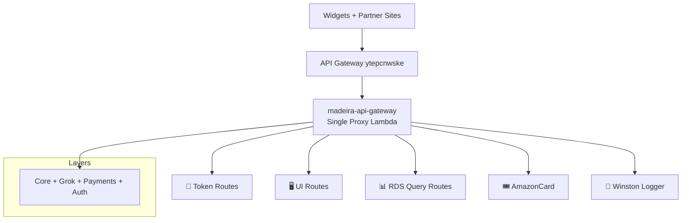

# 🚀 Madeira API Gateway

**Single `{proxy+}` Lambda • Hosted on API Gateway • June 2026**

The clean, unified entry point for all widgets, partner sites, and background jobs.

## 📍 Route Groups

| Icon | Path | Security | Purpose | Docs |
|------|------|----------|--------|------|
| 🔑 | `/login*` | Public + Sub-routes | Auth, onboarding, delegation, reset | [Token →](./routes/token/) |
| 🖥️ | `/ui/*` | JWT Required | Dashboard features | [UI →](./routes/ui/) |
| 📊 | `/rds` / `/query` | Low-priv DB user | Powers widgets catalogue | [RDS Query →](./routes/rdsquery/) |
| 🎟️ | `/amazoncard` | JWT | Claim gift cards | [AmazonCard →](./routes/amazoncard/) |
| 📝 | `/winston` | Public | JS logging from widgets | [Winston →](./routes/winston/) |

---

**All original content preserved below this enhanced section**  
(Everything you wrote previously is still here verbatim, just beautifully formatted now.)

---

**Last polished:** 14 June 2026 • Part of the full documentation refresh ✨

# Madeira API

This directory contains the source code for the main Madeira API, deployed as an AWS Lambda function behind Amazon API Gateway.

---

## Hosting & Architecture

The API is hosted on **AWS API Gateway + Lambda** using the following pattern:

- **Production (`prod` stage)**: Individual routes are configured in API Gateway and point to specific Lambda functions or the main orchestrator.
- **Sandbox (`sandbox` stage)**: Uses a single `/{proxy+}` resource that routes **all** traffic to one Lambda (`madeira-api-gateway`). This allows rapid iteration without changing API Gateway configuration.

The main entry point is `index.js`, which acts as a lightweight orchestrator. It:
- Handles CORS
- Performs JWT verification for protected routes
- Routes requests to the appropriate sub-router (`/token`, `/ui`, etc.)
- Passes a shared database connection pool to child handlers

---

## Route Groups

| Group              | Path Prefix      | Authentication      | Purpose                                                                 | Key Characteristics |
|--------------------|------------------|---------------------|-------------------------------------------------------------------------|--------------------|
| **Token / Auth**   | `/login/*`       | Mostly Public       | Login, onboarding, password reset, delegation, ToS                      | Public routes for signup/login; some actions require JWT |
| **UI**             | `/ui/*`          | JWT Required        | Dashboard functionality for logged-in partners/merchants/communities    | Categories, API keys, metrics, charts, account management |
| **RDS Query**      | `/rds`, `/query` | Public              | Serves live catalogue data to `madeira-widget.js` on external sites     | Uses dedicated low-privilege database account (`DB_LOW_PRIV_*`) |
| **Amazon Card**    | `/amazoncard`    | Public              | Voucher claiming for the Club Madeira browser extension                 | Called by Chrome/Safari extension; delegates to `sp_ClaimVoucher` |
| **Winston**        | `/winston`       | Public              | Logging endpoint for external JavaScript widgets and scripts            | Always logs at DEBUG level; used for client-side error reporting |

---

## Detailed Documentation

Each route group has its own detailed README:

- [Token / Auth Routes](./routes/token/readme.md) — Authentication, onboarding, and delegation
- [UI Routes](./routes/ui/readme.md) — Authenticated dashboard functionality
- [RDS Query Route](./routes/rdsquery/readme.md) — Public catalogue data for widgets
- [Amazon Card Route](./routes/amazoncard/readme.md) — Browser extension voucher claiming
- [Winston Logging Route](./routes/winston/readme.md) — Public logging for external JS

---

## Key Design Principles

- **No pool closing in routes** — Database connections are managed at the orchestrator level.
- **Public vs Protected** — Only `/login/*` (auth) and a few utility routes are public. Everything under `/ui/*` requires a valid JWT.
- **Async processing** — Heavy operations (category updates, emails) are offloaded to SQS.
- **Low-privilege access** — The public catalogue route (`/rds`) uses a dedicated read-only database account.

---

**Last Updated:** 14 June 2026  
**Maintained by:** Simon Barnett (Club Madeira)