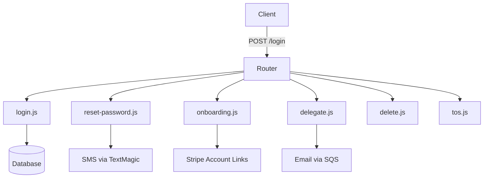

# 🔐 Token / Auth Routes (`/API/routes/token`)

**Purpose:**  
This is the core authentication and user lifecycle module for Club Madeira. It handles login, onboarding (for partners, merchants, and communities), password reset, delegation, account deletion, and Terms of Service.

All routes are mounted under `/login/*` in the main API.

---

## 📋 Route Summary

| Path                              | Method | Action          | Auth Required | Description                                      |
|-----------------------------------|--------|-----------------|---------------|--------------------------------------------------|
| `/login`                          | POST   | login           | No            | Email + password login, returns JWT              |
| `/login/reset-password`           | POST   | request         | No            | Request password reset (sends SMS/Email)         |
| `/login/verify-reset-code`        | POST   | verify          | No            | Verify OTP + set new password                    |
| `/login/onboarding`               | GET    | start           | No            | Start onboarding flow (returns ToS + token)      |
| `/login/generate-onboarding-token`| POST   | generate        | No            | Generate onboarding token for new users          |
| `/login/validate-onboarding-token`| PUT    | validate        | No            | Validate PIN and create Stripe account link      |
| `/login/complete-signup`          | POST   | complete        | No            | Finalize signup + set password                   |
| `/login/delegate`                 | POST   | initiate        | JWT           | Start delegation to another user                 |
| `/login/acceptdelegation`         | POST   | accept          | No            | Accept delegation invitation                     |
| `/login/delete`                   | POST   | initiate        | JWT           | Request account deletion                         |
| `/login/deleteconfirm`            | POST   | confirm         | JWT           | Confirm deletion with OTP                        |
| `/login/tos`                      | GET    | tos             | No            | Serve Terms of Service from S3                   |
| `/login/claims`                   | GET    | claims          | No            | Legacy claims endpoint (being phased out)        |

---

## 🔄 Architecture

---

## 🛠️ Key Design Rules

- **Single shared pool** — The router creates one DB pool and passes it to all handlers. Routes **must not** close the pool.
- **Sandbox flag** — Every handler receives `{ pool, sandbox }`.
- **SystemOTPs table** — All PINs, onboarding tokens, delegation, and deletion codes now live in the consolidated `SystemOTPs` table.
- **Email via SQS** — Onboarding, delegation, and merchant emails are enqueued to the catalogue queue instead of being sent directly.
- **JWT signing** — Uses the shared JWT layer (`/opt/nodejs/jwt`).

---

## 📁 Key Files in This Folder

- `index.js` — Main router (maps paths to handlers + actions)
- `login.js` — Email/password authentication
- `reset-password.js` — Password reset flow (request + verify)
- `onboarding.js` — Full onboarding (generate token, validate PIN, complete signup)
- `delegate.js` — Account delegation (initiate + accept)
- `delete.js` — Account deletion (initiate + confirm)
- `tos.js` — Serves Terms of Service from S3
- `helpers.js` — Shared helpers (getUserByEmail, generatePin, parseBody, etc.)

---

## 🔑 Important Notes

- Most routes under `/login/*` are **public** (no JWT) because they are used during signup/login flows.
- Delegation and deletion require a valid JWT.
- All PIN/OTP logic now uses the new `SystemOTPs` table with JSON payload for flexible data.
- Emails are no longer sent directly from the API — they are enqueued to SQS catalogue for reliable delivery.

---

**Last Updated:** 14 June 2026  
**Maintained by:** Simon Barnett (Club Madeira)