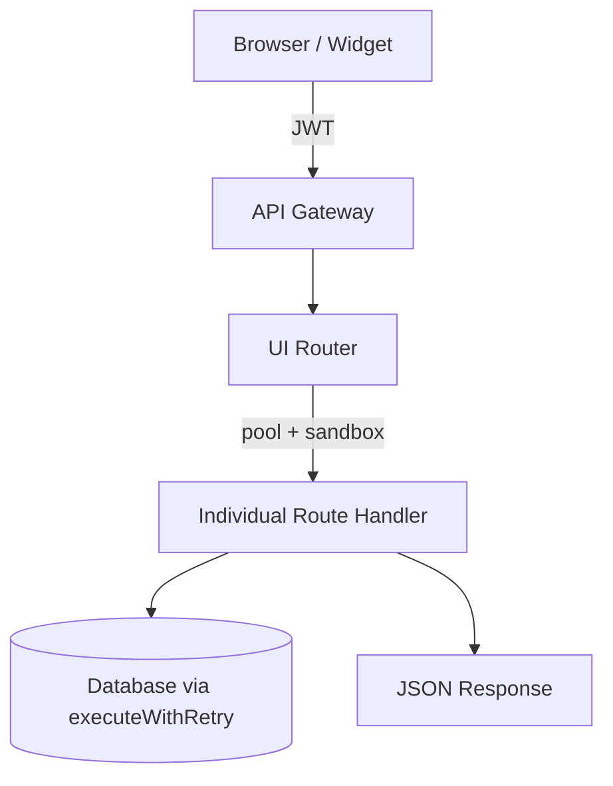

# 🖥️ UI Routes (`/API/routes/ui`)

**Purpose:**  
This module handles all authenticated dashboard functionality for logged-in partners, merchants, and communities. It requires a valid JWT and provides access to API keys, categories, metrics, charts, merchant parts, and account management.

---

## 📋 Route Summary

| Path                    | Methods     | Description                                      | Key Features |
|-------------------------|-------------|--------------------------------------------------|--------------|
| `/ui/api-keys`          | GET, POST, DELETE | Manage API keys for external services           | Add, list, delete keys for Magento, OpenAI, etc. |
| `/ui/cms-providers`     | GET         | List available CMS/e-commerce providers         | Used in catalog preview widget |
| `/ui/metrics`           | GET         | Dashboard metrics and stats                     | Quick overview numbers |
| `/ui/chart-data`        | GET         | Chart data for reports                          | Granularity (day/week/month) + report types |
| `/ui/merchant-parts`    | GET         | Merchant parts data                             | Used in merchant dashboard |
| `/ui/category`          | GET, POST   | Category management + status                    | Uses `clubscan.status` instead of old `isProcessing` flag |
| `/ui/category/reset`    | POST        | Reset category processing status                | Admin action |
| `/ui/delete`            | POST        | Account deletion flow                           | Moved from token routes |
| `/ui/add-role`          | POST        | Add merchant role to user                       | Requires ToS agreement |
| `/ui/reset`             | POST        | Reset processing flags                          | Admin utility |

---

## 🔄 Request Flow

---

## 🛠️ Key Design Principles

- **Pool passed from router** — The `index.js` in this folder creates the DB pool and passes `{ pool, sandbox }` to every handler. Routes **must never** close the pool.
- **JWT required** — All routes under `/ui/*` require a valid JWT (decoded and attached by the main orchestrator).
- **Category status migration** — The old `isProcessing` flag has been replaced with `clubscan.status`. The UI now waits for `status = 'complete'`.
- **No direct S3 usage** — Most file operations have been moved out of the API.

---

## 📁 Key Files

- `index.js` — UI router (maps paths and passes pool/sandbox)
- `apiKeys.js` — Full CRUD for user API keys
- `category.js` — Category management + clubscan status checks
- `chartData.js` — Chart data generation
- `metrics.js` — Dashboard metrics
- `cmsProviders.js` — List of supported CMS platforms
- `merchantParts.js` — Merchant parts endpoint
- `delete.js` — Account deletion (moved from token)
- `addRole.js` — Add merchant permission

---

## 🔑 Important Notes

- The category route now relies on `clubscan.status` (values like `onboarding_complete`, `catalog_complete`, `complete`).
- `isProcessing` flag has been fully removed.
- All SQL uses `executeWithRetry` from the core layer.
- This router is only used after login — it is **not** public.

---

**Last Updated:** 14 June 2026  
**Maintained by:** Simon Barnett (Club Madeira)