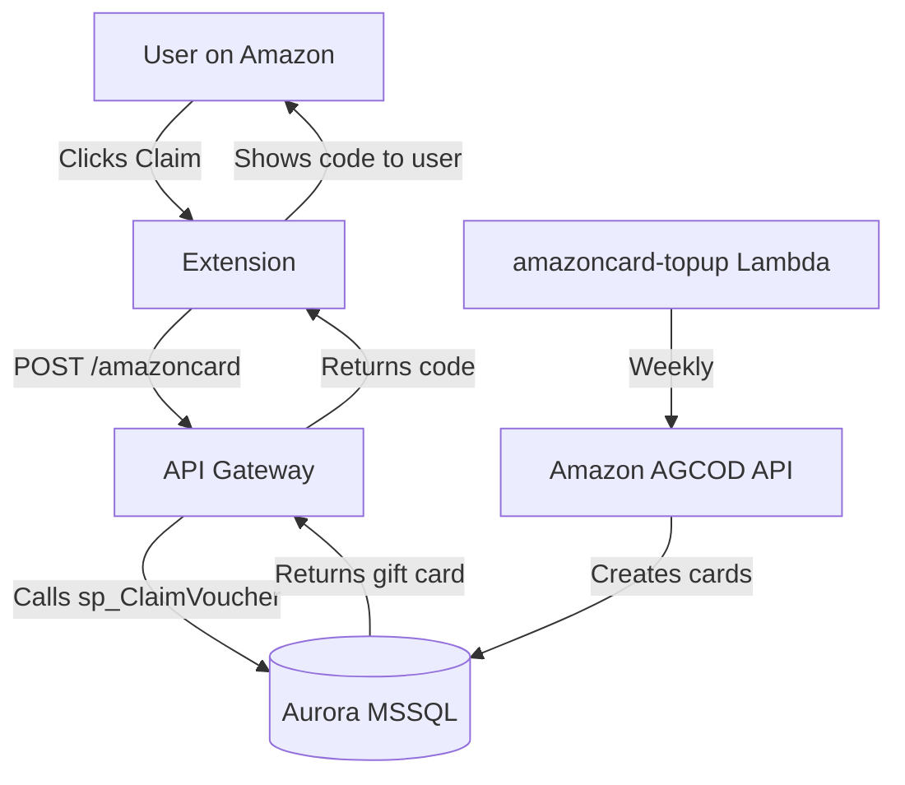

# 🔌 Club Madeira Browser Extension

This folder contains the **browser extensions** for Club Madeira.

The extensions enhance the shopping experience on Amazon by:
- Automatically injecting the user’s affiliate tag
- Showing a prominent **"Claim my voucher"** button on Amazon product pages

---

## Supported Browsers

| Browser  | Folder          | Status     | Notes                              |
|----------|------------------|------------|------------------------------------|
| Chrome   | `chrome/`        | Active     | Manifest V3                        |
| Safari   | `safari/`        | Active     | App Extension + Content Blocker    |

---

## How It Works

### 1. Affiliate Tag Injection

The extension uses `declarativeNetRequest` (Chrome) / Content Blocker (Safari) to rewrite Amazon URLs and inject the user’s affiliate tag in real time.

### 2. Voucher Claiming

When a user is logged into Club Madeira, the extension displays a **Claim Voucher** button on Amazon pages.

Clicking the button:
1. Sends a request to the backend API
2. Calls the `sp_ClaimVoucher` stored procedure
3. Returns a valid Amazon Gift Card code (if available)

---

## Backend Integration

The extension is tightly integrated with two key backend components:

### API Route: `/amazoncard`

**Location:** `API/routes/amazoncard/`

This is the public endpoint the extension calls to claim a voucher.

- No JWT required (uses affiliate tag from URL or localStorage)
- Calls the database stored procedure `sp_ClaimVoucher`
- Returns a gift card code + success/failure status

### Lambda: `madeira-amazoncard-topup`

**Location:** `Lambdas/madeira-amazoncard-topup/`

This Lambda runs **weekly** (via EventBridge Scheduler) and:

- Uses Amazon AGCOD v2 API to generate new gift cards in bulk
- Stores them in the `amazon_cards` table with status `available`
- Distributes cards across days of the week for even claiming

This separation keeps the sensitive gift card creation process isolated and scheduled, while the claiming process remains fast and on-demand.

---

## Architecture Flow

---

## Related Documentation

- [API Amazon Card Route](../API/routes/amazoncard/readme.md)
- [Amazon Card Top-up Lambda](../Lambdas/madeira-amazoncard-topup/readme.md)
- [S3-Bucket Widgets](../S3-Bucket/readme.md) – Contains `madeira-extension.js` (promotional badge)

---

## Development Notes

- The extension is intentionally lightweight.
- All business logic (claiming, fraud checks, cooldowns) lives in the backend stored procedure.
- Gift card supply is managed centrally by the weekly top-up Lambda.

**Last Updated:** 14 June 2026  
**Maintained by:** Simon Barnett (Club Madeira)