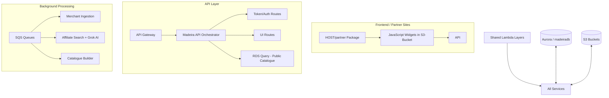

# Club Madeira — Affiliate Commerce Platform

**The complete serverless ecosystem powering Club, Community & Merchant affiliate commerce.**

Built on **AWS Lambda + API Gateway + SQS + Aurora** with heavy use of **shared Lambda Layers** for maximum reusability and multi-region deployment capability.

---

## 🚀 Big Picture

Club Madeira is an intelligent affiliate platform that connects:

- **Clubs & Communities** (who earn commissions)
- **Merchants** (who list products)
- **Partners** (web designers/agencies who onboard clubs)

The system allows any website to embed powerful affiliate widgets that dynamically display relevant products, while running sophisticated background processing (catalogue ingestion, AI relevance scoring via Grok, multi-network search, etc.).

### Merchant Parts & AI Catalogue Intelligence

The platform excels at **pulling real merchant products** from multiple sources (Awin, Amazon, eBay) and using **Grok AI** to intelligently select the best parts for each website's categories and audience. This AI-driven curation is what makes the catalogues feel high-quality and relevant.

**Note on integrations**: Connectors for Wix, Shopify and WooCommerce are built and tested. Currently we have hundreds of active Awin advertisers populating the system, while the other platforms have no live merchants yet.

### Core Value Proposition

A fully modular, **region-agnostic**, production-grade serverless platform that can be deployed in any AWS region with minimal changes thanks to **centralised Layers** + **SSM Parameter Store** configuration.

---

## 🏗️ High-Level Architecture

---

## 📁 Repository Structure & Documentation

| Section | Purpose | Key Documentation |
|--------|--------|-------------------|
| **[API](./API)** | Main HTTP API + routing | [API/README.md](./API/README.md) |
| **[Layers](./Layers)** | Reusable business logic & AWS clients | [Core](./Layers/madeira-core-layer/readme.md) • [Auth](./Layers/madeira-auth-layer/readme.md) • [Payments](./Layers/madeira-payments-layer/readme.md) • [Grok](./Layers/madeira-grok-layer/readme.md) |
| **[SQS](./SQS)** | Asynchronous background jobs | [SQS Overview](./SQS/readme.md) |
| **[RDS](./RDS)** | Database schema & low-priv access | [RDS/README.md](./RDS/readme.md) |
| **[S3-Bucket](./S3-Bucket)** | All JavaScript widgets | Widgets for clubs, partners, merchants |
| **[HOST/partner](./HOST/partner)** | Complete package given to web agencies | [Partner Guide](./HOST/partner/readme.md) |
| **[Lambdas](./Lambdas)** | Standalone functions (e.g. Amazon Top-up) | [Lambdas README](./Lambdas/README.md) |
| **[Extension](./Extension)** | Browser extension for voucher claiming | Chrome + Safari |

---

## ✨ Key Innovations & Design Highlights

- **Multi-Region Ready**: All configuration lives in SSM Parameter Store + shared Layers.
- **Layer-First Architecture**: Four powerful shared layers drastically reduce duplication.
- **Event-Driven Backbone**: Three specialised SQS Lambdas handle heavy lifting.
- **Smart Sandboxing**: Every pipeline supports a `sandbox: true` flag.
- **Self-Healing**: Automatic recovery + **[madeira-layer-cake](Lambdas/madeira-layer-cake)** diagnostic Lambda.
- **Embedded Widgets**: Zero-dependency JavaScript that works anywhere.

---

**Made with ❤️ for clubs, communities and independent merchants.**

**Club Madeira — Turning passion into profit.**

_Last updated: 14 June 2026_