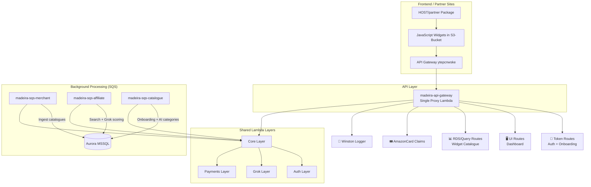

# 🏠 Club Madeira — Affiliate Commerce Platform

**The complete serverless ecosystem** powering Club, Community & Merchant affiliate commerce.

Built on **AWS Lambda + API Gateway + SQS + Aurora** with heavy use of **shared Lambda Layers** for maximum reusability and multi-region deployment capability.

---

## 🚀 Big Picture

Club Madeira is an intelligent affiliate platform that connects:

- **Clubs & Communities** (who earn commissions)
- **Merchants** (who list products)
- **Partners** (web designers/agencies who onboard clubs)

The system allows any website to embed powerful affiliate widgets that dynamically display relevant products, while running sophisticated background processing (catalogue ingestion, AI relevance scoring via Grok, multi-network search, etc.).

### Core Value Proposition

A fully modular, **region-agnostic**, production-grade serverless platform that can be deployed in any AWS region with minimal changes thanks to **centralised Layers** + **SSM Parameter Store** configuration.

## 🏗️ High-Level Architecture

## 📁 Repository Structure

| Folder | Purpose | Key README |
|--------|---------|------------|
| **API/** | Main API Gateway + route handlers (token, ui, rdsquery, etc.) | [API/readme.md](./API/readme.md) |
| **SQS/** | Background job processors (merchant ingest, affiliate search, catalogue orchestration) | [SQS/readme.md](./SQS/readme.md) |
| **Lambdas/** | Standalone Lambdas (awin-clubscan, amazoncard-topup, layer-cake tester) | [Lambdas/readme.md](./Lambdas/readme.md) |
| **Layers/** | Shared Lambda Layers (core, auth, grok, payments) | [Layers/readme.md](./Layers/readme.md) |
| **RDS/** | Database schema, stored procedures, migration notes | [RDS/readme.md](./RDS/readme.md) |
| **HOST/partner/** | Partner onboarding package (widgets, templates, PWA setup) | [HOST/partner/readme.md](./HOST/partner/readme.md) |
| **S3-Bucket/** | Static widgets, CSS, images, manifests for partner sites | [S3-Bucket widgets docs](./S3-Bucket) |
| **Extension/** | Browser extension (Chrome/Safari) for voucher claiming | [Extension README](./Extension) |

## ✨ Key Design Principles

- **Single entry point where possible** — Sandbox uses `/{proxy+}` for rapid iteration without touching API Gateway config.
- **Heavy Layer reuse** — Business logic stays thin; shared code lives in Layers for consistency and easier updates.
- **Sandbox everywhere** — Every pipeline, route, and job respects a `sandbox` flag for safe testing.
- **Self-healing configuration** — SSM placeholders are created automatically; services recover gracefully.
- **Zero pool leaks** — DB connections created at orchestrator level, passed down, closed at the top.
- **Async by default** — Heavy work (emails, category building, Grok scoring) is offloaded to SQS.
- **Low-privilege by design** — Public widget catalogue uses dedicated read-only DB user.

## 📚 Full Documentation Map

- [SQS System Overview](./SQS/readme.md)
- [API Architecture](./API/readme.md)
- [Core Layer](./Layers/madeira-core-layer/readme.md)
- [Partner Integration Guide](./HOST/partner/readme.md)
- [Database Schema](./RDS/readme.md)

## 🛠️ Getting Started & Deployment

See individual folder readmes for detailed instructions.

General flow:
1. Deploy Lambda Layers first
2. Deploy API + SQS functions
3. Configure SSM parameters (or use self-healing placeholders)
4. Upload widgets to S3
5. Give partners the `/HOST/partner` package

## 📖 Philosophy

Maximum reusability, strong separation of concerns, and developer experience first.

**Project Owner**: Simon Barnett  
**Status**: Production + Sandbox environments active  
**Last Updated**: 14 June 2026

---

Made with ❤️ for clubs, communities and independent merchants.

**Club Madeira — Turning passion into profit.**