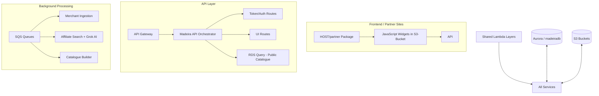

# Club Madeira — Affiliate Commerce Platform

**The complete serverless ecosystem powering Club, Community & Merchant affiliate commerce.**

Built on **AWS Lambda + API Gateway + SQS + Aurora** with heavy use of **shared Lambda Layers** for maximum reusability and multi-region deployment capability.

---

## 🚀 Big Picture

Club Madeira is an intelligent affiliate platform that connects:

- **Clubs & Communities** (who earn commissions)
- **Merchants** (who list products)
- **Partners** (web designers/agencies who onboard clubs)

The system allows any website to embed powerful affiliate widgets that dynamically display relevant products, while running sophisticated background processing (catalogue ingestion, AI relevance scoring via Grok, multi-network search, etc.).

### Core Value Proposition

A fully modular, **region-agnostic**, production-grade serverless platform that can be deployed in any AWS region with minimal changes thanks to **centralised Layers** + **SSM Parameter Store** configuration.

---

## 🏗️ High-Level Architecture

---

## 📁 Repository Structure & Documentation

| Section | Purpose | Key Documentation |
|--------|--------|-------------------|
| **[API](./API)** | Main HTTP API + routing | [API/README.md](./API/README.md) |
| **[Layers](./Layers)** | Reusable business logic & AWS clients | [Core](./Layers/madeira-core-layer/readme.md) • [Auth](./Layers/madeira-auth-layer/readme.md) • [Payments](./Layers/madeira-payments-layer/readme.md) • [Grok](./Layers/madeira-grok-layer/readme.md) |
| **[SQS](./SQS)** | Asynchronous background jobs | [SQS Overview](./SQS/readme.md) |
| **[RDS](./RDS)** | Database schema & low-priv access | [RDS/README.md](./RDS/readme.md) |
| **[S3-Bucket](./S3-Bucket)** | All JavaScript widgets | Widgets for clubs, partners, merchants |
| **[HOST/partner](./HOST/partner)** | Complete package given to web agencies | [Partner Guide](./HOST/partner/readme.md) |
| **[Lambdas](./Lambdas)** | Standalone functions (e.g. Amazon Top-up) | — |
| **[Extension](./Extension)** | Browser extension for voucher claiming | Chrome + Safari |

---

## ✨ Key Innovations & Design Highlights

- **Multi-Region Ready**: All configuration lives in SSM Parameter Store + shared Layers. Deploy the entire platform to `eu-west-1`, `us-east-1`, `ap-southeast-2` etc. with almost zero code changes.
- **Layer-First Architecture**: Four powerful shared layers drastically reduce duplication and improve security/maintainability.
- **Event-Driven Backbone**: Three specialised SQS Lambdas handle heavy lifting (product ingestion, affiliate enrichment, catalogue building).
- **Smart Sandboxing**: Every pipeline supports a `sandbox: true` flag for safe testing and development.
- **Self-Healing & Resilient**: Automatic recovery from stuck states, retry logic, and graceful degradation built in.
- **Embedded Widgets**: Zero-dependency JavaScript widgets that work on any static site (Wix, WordPress, custom, etc.).

---

## 🧩 Major Components

### 1. API (`/API`)
Full-featured serverless REST API with public auth endpoints and protected UI/dashboard functionality. Uses a single orchestrator Lambda in sandbox mode for rapid iteration.

### 2. Shared Layers (`/Layers`)
The heart of the platform. Reusable across all services.

### 3. Background Processing (`/SQS`)
- **Merchant Queue**: Imports full catalogues from Shopify, WooCommerce, Magento, etc.
- **Affiliate Queue**: Searches Awin, eBay, Amazon + runs Grok relevance scoring in batches.
- **Catalogue Queue**: Orchestrates onboarding, category management, and live catalogue building.

### 4. Database (`/RDS`)
Sophisticated MSSQL schema with stored procedures for performance-critical operations.

### 5. Client-Side (`/S3-Bucket` + `/HOST/partner`)
Production-ready widgets and full partner onboarding package.

---

## 🚀 Getting Started & Deployment

See individual folder readmes for detailed instructions.

General flow:
1. Deploy Lambda Layers first
2. Deploy API + SQS functions
3. Configure SSM parameters (or use self-healing placeholders)
4. Upload widgets to S3
5. Give partners the `/HOST/partner` package

---

## 📚 Full Documentation Map

- [SQS System Overview](./SQS/readme.md)
- [API Architecture](./API/README.md)
- [Core Layer](./Layers/madeira-core-layer/readme.md)
- [Partner Integration Guide](./HOST/partner/readme.md)
- [Database Schema](./RDS/readme.md)

---

**Project Owner**: Simon Barnett  
**Status**: Production + Sandbox environments active  
**Philosophy**: Maximum reusability, strong separation of concerns, and developer experience first.

---

Made with ❤️ for clubs, communities and independent merchants.

**Club Madeira — Turning passion into profit.**

_Last updated: 14 June 2026_