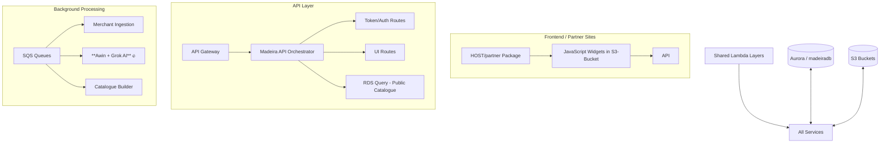

# Club Madeira — Affiliate Commerce Platform

**The complete serverless ecosystem powering Club, Community & Merchant affiliate commerce.**

Built on **AWS Lambda + API Gateway + SQS + Aurora** with heavy use of **shared Lambda Layers** for maximum reusability and multi-region deployment capability.

---

## 🚀 Big Picture

Club Madeira is an **intelligent multi-sided affiliate platform** that connects:

- **Clubs & Communities** (who earn commissions by embedding widgets)
- **Merchants** (who list products via multiple networks)
- **Partners** (web agencies who onboard clubs and earn override commissions)

### The Critical Awin + Merchant Parts Engine 🔥

**One of the most important parts of the entire system** is the **[madeira-awin-clubscan](./Lambdas/madeira-awin-clubscan)** Lambda and its associated queues.

This pipeline continuously ingests high-quality merchant catalogues from **Awin** (and other networks), runs **Grok-powered relevance scoring**, and maintains a rich pool of **merchant parts/products**. 

> **Why this matters**: The entire recommendation engine (Global mode + Club-specific mode) and the live catalogue widgets **depend on having a healthy, fresh supply of merchant parts**. Without strong Awin ingestion, there is nothing compelling for clubs to show their visitors.

When a partner successfully helps a club onboard an Awin advertiser, they earn an **extra commission override** — creating powerful incentive alignment across the whole ecosystem.

See: [Awin Clubscan Documentation](./Lambdas/madeira-awin-clubscan/README.md)

### Self-Healing & Layer Verification

The **[madeira-layer-cake](./Lambdas/madeira-layer-cake)** Lambda serves as the **official integration test harness** for all shared layers. It exercises every major component (`helpers`, `grok`, `jwt`, `mailer`, `stripe`, database, etc.) and acts as both a diagnostic tool and a living example of correct layer usage.

---

## 🏗️ High-Level Architecture

---

## 📁 Repository Structure & Documentation

| Section | Purpose | Key Documentation |
|--------|--------|-------------------|
| **[API](./API)** | Main HTTP API + routing | [API/README.md](./API/README.md) |
| **[Layers](./Layers)** | Reusable business logic & AWS clients | [Core](./Layers/madeira-core-layer/readme.md) • [Auth](./Layers/madeira-auth-layer/readme.md) • [Payments](./Layers/madeira-payments-layer/readme.md) • [Grok](./Layers/madeira-grok-layer/readme.md) |
| **[SQS](./SQS)** | Asynchronous background jobs | [SQS Overview](./SQS/readme.md) |
| **[RDS](./RDS)** | Database schema & low-priv access | [RDS/README.md](./RDS/readme.md) |
| **[S3-Bucket](./S3-Bucket)** | All JavaScript widgets | Widgets for clubs, partners, merchants |
| **[HOST/partner](./HOST/partner)** | Complete package given to web agencies | [Partner Guide](./HOST/partner/readme.md) |
| **[Lambdas](./Lambdas)** | Standalone & critical functions | **[Awin Clubscan](./Lambdas/madeira-awin-clubscan/README.md)** • [Layer Cake](./Lambdas/madeira-layer-cake/README.md) • [Amazon Top-up](./Lambdas/amazoncard-topup/README.md) |
| **[Extension](./Extension)** | Browser extension for voucher claiming | Chrome + Safari |

---

## ✨ Key Innovations & Design Highlights

- **Multi-Region Ready**: All configuration lives in SSM Parameter Store + shared Layers.
- **Layer-First Architecture**: Four powerful shared layers drastically reduce duplication.
- **Event-Driven Backbone**: Three specialised SQS Lambdas handle heavy lifting.
- **Critical Merchant Supply Chain**: Awin ingestion pipeline is the lifeblood of product availability.
- **Self-Healing & Diagnostics**: `madeira-layer-cake` provides continuous validation of the layer ecosystem.
- **Smart Sandboxing**: Every pipeline supports a `sandbox: true` flag.

---

## 🧩 Major Components

### 1. API (`/API`)
Full-featured serverless REST API...

### 2. Shared Layers (`/Layers`)
The heart of the platform...

### 3. Background Processing (`/SQS`)
...

### 4. **Awin-Powered Merchant Engine** (`/Lambdas/madeira-awin-clubscan`)
**Critical system component.** Maintains merchant product inventory through continuous Awin scraping, AI scoring, and enrichment. Powers all product recommendations shown to end users.

### 5. Database (`/RDS`)
...

---

## 🚀 Getting Started & Deployment

...

---

## 📚 Full Documentation Map

- [SQS System Overview](./SQS/readme.md)
- [API Architecture](./API/README.md)
- [Awin Clubscan + Merchant Pipeline](./Lambdas/madeira-awin-clubscan/README.md) ← **Highly Recommended**
- [Layer Cake - Layer Health Check](./Lambdas/madeira-layer-cake/README.md)
- [Core Layer](./Layers/madeira-core-layer/readme.md)
- [Partner Integration Guide](./HOST/partner/readme.md)

---

**Project Owner**: Simon Barnett  
**Status**: Production + Sandbox environments active  
**Philosophy**: Maximum reusability, strong separation of concerns, and developer experience first.

---

Made with ❤️ for clubs, communities and independent merchants.

**Club Madeira — Turning passion into profit.**

_Last updated: 14 June 2026_