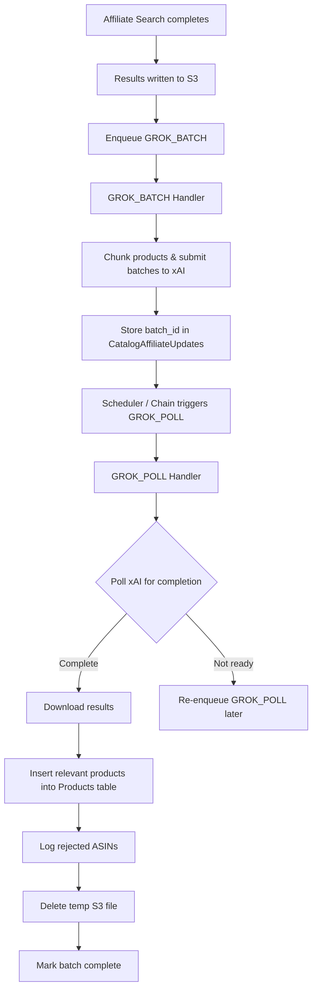

# Grok Batch Flow

This document explains how the system uses **xAI Grok Batch API** to perform large-scale product relevance scoring in the affiliate pipeline.

## Overview

The `madeira-sqs-affiliate` queue uses **Grok Batch** (instead of regular Grok calls) when scoring large numbers of products against club categories. This approach is significantly more cost-effective for bulk work.

The flow is asynchronous and uses two message types:
- `GROK_BATCH` — Submits work to xAI
- `GROK_POLL` — Checks status and processes results when complete

## Why Use Grok Batch?

| Reason                    | Benefit |
|---------------------------|--------|
| High volume               | Can process thousands of products efficiently |
| Cost                      | Batch API is much cheaper than real-time calls |
| Non-blocking              | Doesn't hold up Lambda execution while waiting |
| Structured output         | Still returns validated JSON using schemas |

Regular Grok is used for smaller, faster tasks (e.g. club recommendations in `madeira-awin-clubscan`).

## High-Level Flow



## Detailed Flow

### 1. GROK_BATCH Message

**Triggered by:** Affiliate search completion

**What it does:**
- Reads the full search results JSON from S3 (one file per affiliate + catalog combination)
- Splits the product list into chunks (controlled by `GROK_BATCH_SIZE`, default = 10)
- Submits each chunk as a structured batch job to xAI using `submitStructuredBatch()`
- Stores the returned `batch_id` in the `CatalogAffiliateUpdates.BatchName` field
- Sets status to `batch_submitted`

### 2. GROK_POLL Message

This message has two operating modes:

#### Discovery Mode
- Triggered by scheduler or manually
- Finds all records in `CatalogAffiliateUpdates` with status `batch_submitted` that are ready to check
- Enqueues a chained `GROK_POLL` message containing the list of batch names

#### Chained Processing Mode
- Processes **one batch at a time** to avoid overloading the system
- Polls xAI for the current status of the batch
- If complete → calls `handleCompletedBatch()`
- If not complete → re-enqueues itself for later

### 3. handleCompletedBatch()

When a batch completes successfully:

1. Downloads the results from xAI
2. Matches Grok’s relevance decisions back to the original products
3. **Inserts relevant products** into the `Products` table
4. **Logs rejected products** into the `RejectedAsins` table
5. Deletes the temporary results file from S3
6. Marks the `CatalogAffiliateUpdates` record as completed
7. Chains the next `GROK_POLL` if more batches are waiting

## Self-Healing Logic

The system includes recovery for stuck jobs:

- Records stuck in `batch_submitted` or `polling` state for too long are automatically reset
- This prevents batches from being permanently orphaned

## Key Files

| File | Location | Responsibility |
|------|----------|----------------|
| `grokBatch.js` | `SQS/madeira-sqs-affiliate/sqs/` | Submits batches to xAI |
| `grokPoll.js` | `SQS/madeira-sqs-affiliate/sqs/` | Polls for completion and processes results |
| `routes/affiliate.js` (or similar) | `SQS/madeira-sqs-affiliate/routes/` | Enqueues `GROK_BATCH` after search |

## Configuration

Relevant environment variables / SSM parameters:

| Parameter              | Default | Description |
|------------------------|---------|-----------|
| `GROK_BATCH_SIZE`      | 10      | Number of products per batch submission |
| `AFFILIATE_BATCH_SIZE` | 100     | Number of products processed per affiliate/catalog |

## Debugging & Monitoring

**Useful queries:**
```sql
-- Find stuck or in-progress batches
SELECT * FROM CatalogAffiliateUpdates 
WHERE Status IN ('batch_submitted', 'polling')
ORDER BY LastUpdate DESC;
```

**Common issues:**
- Batches staying in `batch_submitted` for a long time → check xAI Batch API status
- High number of rejected products → review relevance scoring prompt / `MIN_RELEVANCE_SCORE`
- S3 files not being cleaned up → check `handleCompletedBatch()` logic

**Recommended CloudWatch alarms:**
- Age of oldest message in `madeira-sqs-affiliate` queue
- Number of messages in DLQ (if configured)
- Lambda error rate for `madeira-sqs-affiliate`

## Related Documentation

- [SQS Affiliate Queue Overview](./readme.md)
- [Grok Layer Documentation](../../Layers/madeira-grok-layer/readme.md)
- [CatalogAffiliateUpdates table](../../RDS/readme.md)
