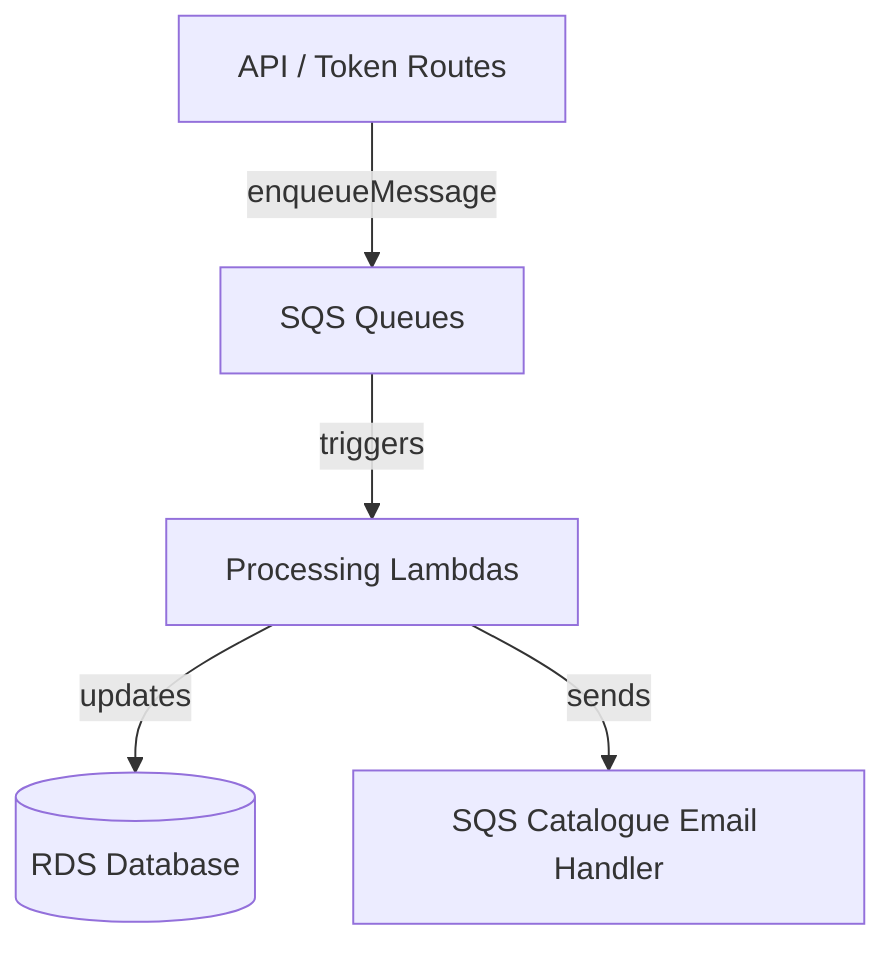

# 📬 SQS - Background Processing Queues

This folder contains the three main SQS-based background processing systems that power the Madeira platform.

## Overview

The Madeira platform uses **Amazon SQS** for reliable, scalable, asynchronous processing. Instead of doing heavy work synchronously in the API or during onboarding, we enqueue messages that are processed by dedicated Lambda functions.

This architecture provides:

- **Decoupling** — API stays fast and responsive
- **Reliability** — Messages are retried automatically on failure
- **Scalability** — Each queue can scale independently
- **Observability** — Clear separation of concerns per domain

## The Three Main Queues

| Queue                        | Purpose                                                                 | Main Message Types                              | Documentation Link                              |
|------------------------------|-------------------------------------------------------------------------|-------------------------------------------------|-------------------------------------------------|
| **madeira-sqs-merchant**     | Ingests full product catalogues from merchant platforms (Shopify, WooCommerce, Magento, etc.) | Merchant sync, product import, stale pair cleanup | [madeira-sqs-merchant/readme.md](madeira-sqs-merchant/readme.md) |
| **madeira-sqs-affiliate**    | Searches affiliate networks (Awin, eBay, Amazon) + runs Grok relevance scoring | Affiliate search, GROK_POLL, scheduler          | [madeira-sqs-affiliate/readme.md](madeira-sqs-affiliate/readme.md) |
| **madeira-sqs-catalogue**    | Orchestrates club/community onboarding and live catalogue building     | ONBOARDING, CLUBSCAN_*, CATEGORY_UPDATE, NOTIFY | [madeira-sqs-catalogue/readme.md](madeira-sqs-catalogue/readme.md) |

## Architecture Pattern

Each queue has its own folder containing:
- `routes/` — Individual message handlers
- `sqs/` — Core processing logic + helpers
- `readme.md` — Detailed documentation

## Common Patterns

- All queues use the **shared Core Layer** (`/opt/nodejs/helpers`)
- Most messages support a `sandbox: true` flag for safe testing
- Email sending has been moved to the catalogue queue (centralized)
- Status tracking uses `clubscan.Status` (replacing old `isProcessing` flags)

## Related Documentation

- [API Routes](../API/README.md) — Where messages are usually enqueued
- [SQS Catalogue Pipeline](madeira-sqs-catalogue/readme.md) — Full onboarding flow
- [Merchant Ingestion](madeira-sqs-merchant/readme.md) — How merchant parts enter the system
- [Affiliate Search](madeira-sqs-affiliate/readme.md) — How Grok-powered relevance scoring works

**Last Updated:** 14 June 2026  
**Maintained by:** Simon Barnett (Club Madeira)